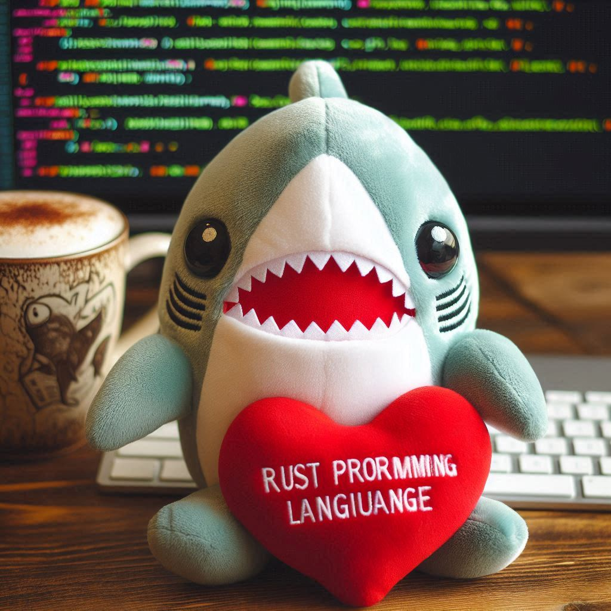

## Rust Practice
# AKA: BLAHAJ LEARNS RUST


## What does this repo contain?

A lot of small projects to help you start lerning Rust (with you Blahaj or without him).
The include:  
- a simple guessing game
- structs
- basic functions
- ownership and references
- conditions

## Wanna help Blahaj learn Rust?
*Bahaj smiles encouragingly*
1. Fork the repository.
2. Create a new branch  
    ```git checkout -b feature-branch```
3. Make your changes and commit them  
    ```git commit -am 'Add new feature'```
4. Push to your branch  
    ```git push origin feature-branch```
5. Create a pull request.

## Or test it locally?
```git clone https://github.com/mzums/rust_practice```

## Requirements
Make sure you have Rust installed before testing the projects locally.